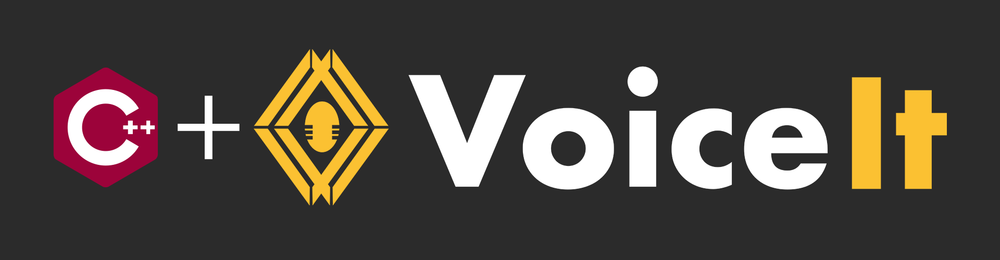

[](https://github.com/voiceittech/VoiceIt3-Cpp)
[](https://github.com/voiceittech/VoiceIt3-Cpp/blob/main/LICENSE)
[](https://github.com/voiceittech/VoiceIt3-Cpp)
[](https://voiceit.io)


A C++ wrapper for VoiceIt's API 3.0 featuring Voice + Face Verification and Identification.

## Installation

```bash
git clone https://github.com/voiceittech/VoiceIt3-Cpp.git
```

Include the header in your project:
```cpp
#include "VoiceIt3.hpp"
```

Requires libcurl: `sudo apt-get install libcurl4-openssl-dev`

## Getting Started

Sign up at [voiceit.io/pricing](https://voiceit.io/pricing) to get your API Key and Token, then log in to the [Dashboard](https://dashboard.voiceit.io) to manage your account.


## API calls
You can visit our [HTTP API 3.0 Documentation](https://api.voiceit.io/?cpp#introduction) for detailed information on each API call.
## Support

If you find this SDK useful, please consider giving it a star on GitHub — it helps others discover the project!

[](https://github.com/voiceittech/VoiceIt3-Cpp/stargazers)

## License

VoiceIt3-Cpp is available under the MIT license. See the LICENSE file for more info.

